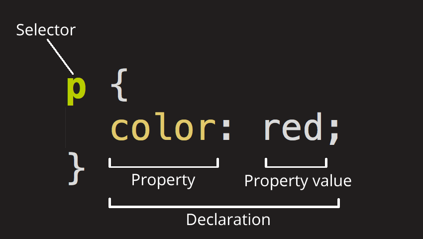
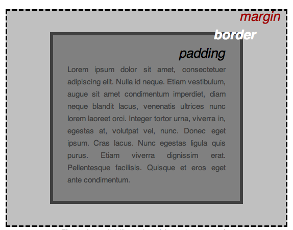

# CSS basics

CSS (Cascading Style Sheets) is the code that styles web content. 

* CSS is not a programming language
* CSS not a markup language either.
* **CSS is a style sheet language**


```css
p {
  color: red;
}
```



* Selector

  This is the HTML element name at the start of the ruleset. It defines the element(s) to be styled (in this example, [``](https://developer.mozilla.org/en-US/docs/Web/HTML/Element/p) elements). To style a different element, change the selector.

* Declaration

  This is a single rule like `color: red;`. It specifies which of the element's **properties** you want to style.

* Properties

  These are ways in which you can style an HTML element. (In this example, `color` is a property of the [``](https://developer.mozilla.org/en-US/docs/Web/HTML/Element/p) elements.) In CSS, you choose which properties you want to affect in the rule.

* Property value

  To the right of the property—after the colon—there is the **property value**. This chooses one out of many possible appearances for a given property. (For example, there are many `color` values in addition to `red`.)

```css
p {
  color: red;
  width: 500px;
  border: 1px solid black;
}
```

## Selecting multiple elements

```css
p, li, h1 {
  color: red;
}
```

## Different types of selectors

https://developer.mozilla.org/en-US/docs/Learn/CSS/Building_blocks/Selectors


## CSS: all about boxes



- `padding`, the space around the content. In the example below, it is the space around the paragraph text.
- `border`, the solid line that is just outside the padding.
- `margin`, the space around the outside of the border.